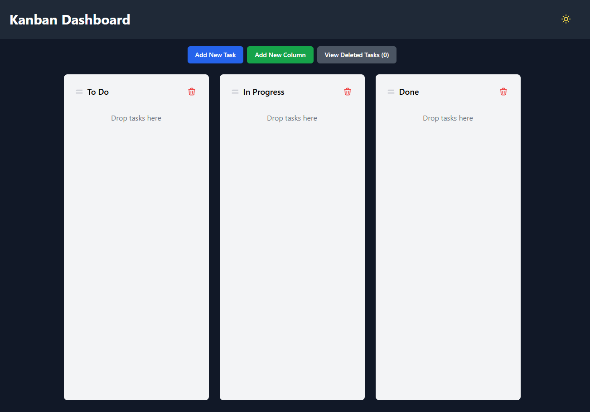
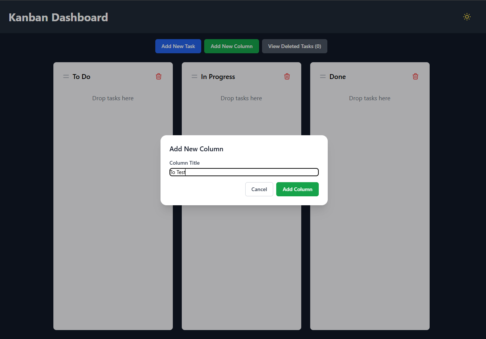
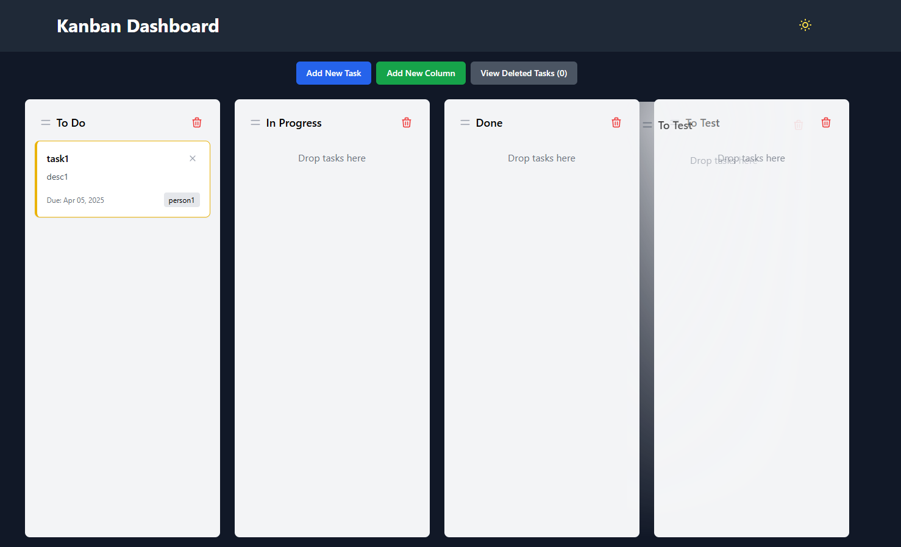
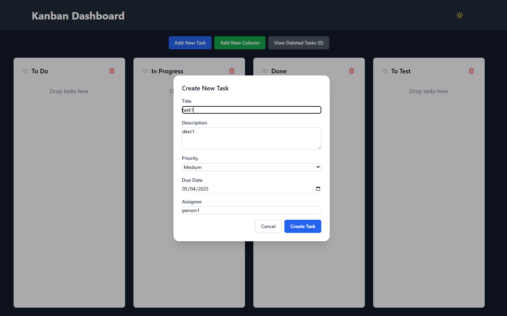
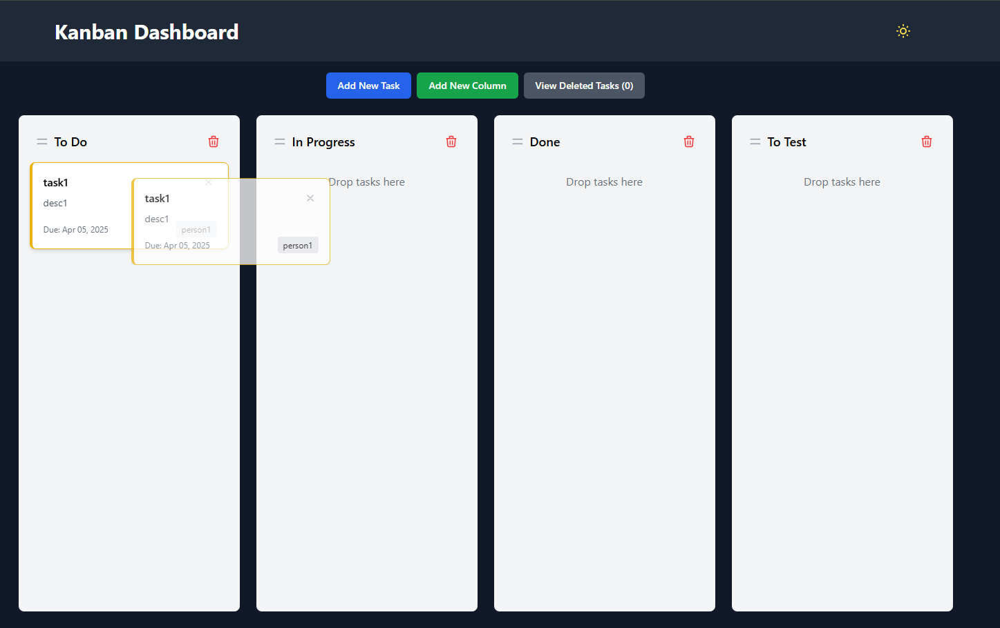
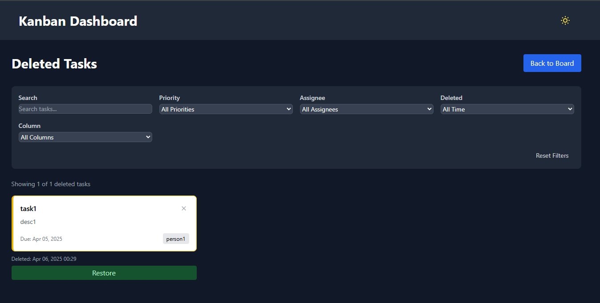
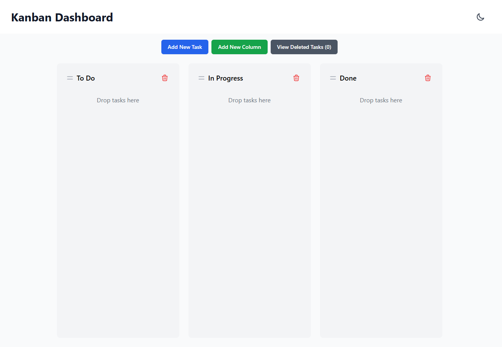

# Vue Kanban Board

A responsive Kanban board built with Vue 3, Pinia, and TypeScript featuring drag-and-drop functionality, task management, and dark/light mode.

*Dark Mode Interface*

## Features

### Board Management
- 📌 **Column Operations**
  - Add new columns
  - Drag-and-drop to reorder columns
  - Delete columns (with confirmation)
  
   | 
  --- | ---

### Task Management
- ✅ **Task Operations**
  - Create tasks with details (title, description, priority, due date, assignee)
  - Drag-and-drop between columns
  - Edit existing tasks
  - Delete tasks (moved to recycle bin)
  
   | 
  --- | ---

### Advanced Features
- 🗑️ **Recycle Bin**
  - View deleted tasks (up to 50 most recent)
  - Restore tasks to original columns
  - Permanent deletion
  - Search and filter functionality
  
  

- 🌓 **Theme Toggle**
  - Switch between light and dark modes
  
  

## Technical Stack

- **Frontend**: Vue 3 (Composition API)
- **State Management**: Pinia
- **Type System**: TypeScript
- **Drag-and-Drop**: vue-draggable
- **Styling**: Tailwind CSS
- **Persistence**: localStorage